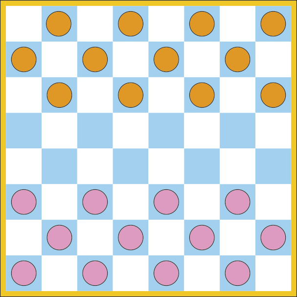
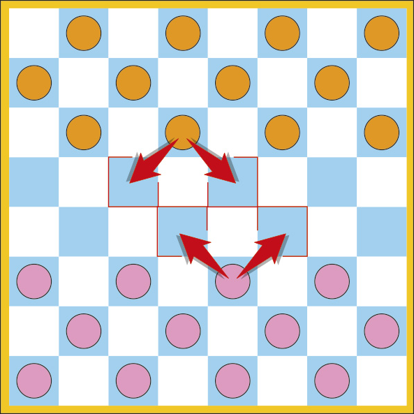
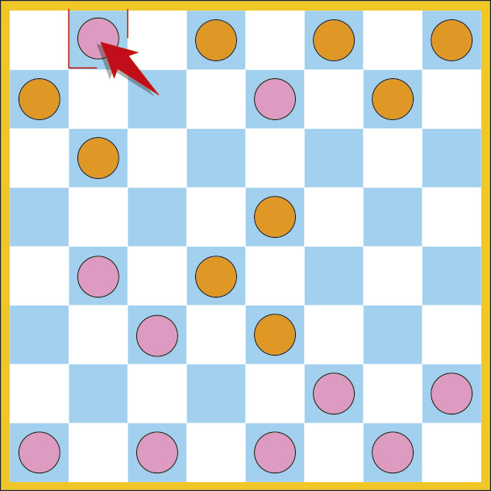
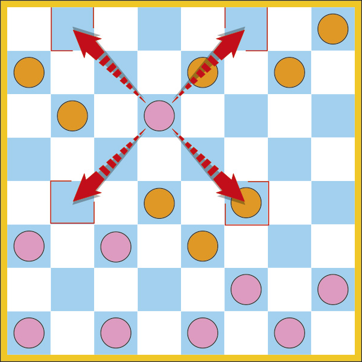
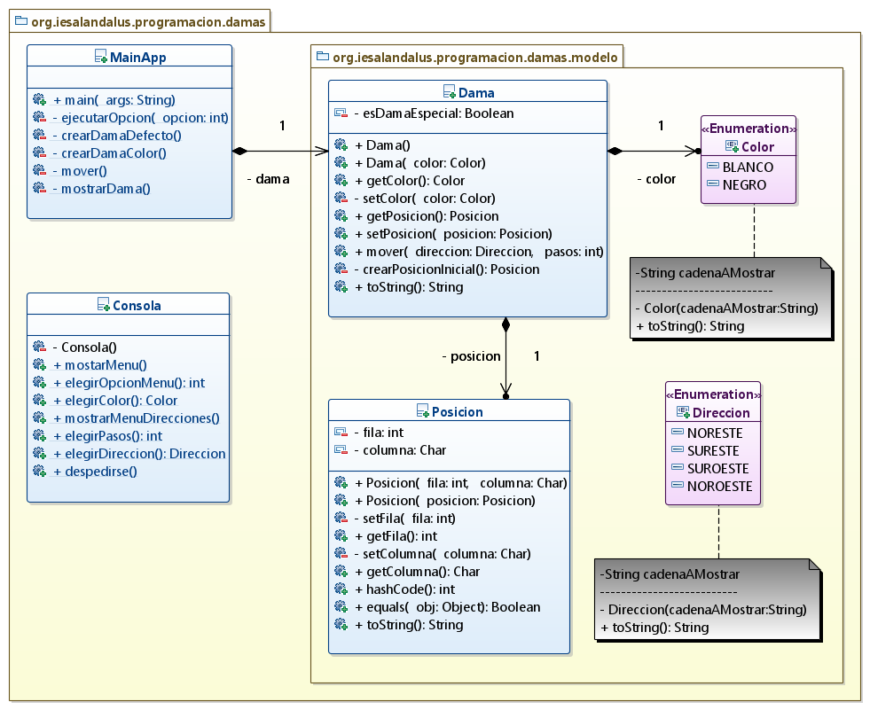

# Tarea Damas
## Profesor: Andrés Rubio del Río
## Alumno: Virginia María Berenguel Expósito

<h4 class="resaltado_inline" style="text-align: center;">¿Qué te pedimos que hagas?</h4>

La tarea va a consistir en modelar el movimiento de una dama por el tablero de dicho juego. <strong>Para controlar la posición en de la dama en las casillas del tablero, se utilizarán las coordenadas que vienen dadas en el tablero de ajedrez, por una fila (del "1" al "8") y una columna (de la "a" a la "h").</strong>

 

Imágenes obtenidas de la web: <a href="https://www.hagaloustedmismo.cl/proyectos/como-hacer-y-jugar-un-juego-de-damas.html" target="_blank" rel="noopener">www.hagaloustedmismo.cl</a> 

En la primera imagen puedes observar cuál es el posicionamiento inicial válido para las damas dependiendo de su color. En la segunda imagen puedes apreciar cuáles son <strong>los movimientos válidos para una dama, siempre hacia adelante, en diagonal y solamente una casilla</strong>.

Deberás controlar que el movimiento de una dama se realice correctamente siguiendo las reglas descritas anteriormente y además no estará permitido realizar movimientos que puedan sacar a la pieza fuera del tablero.

Además, <strong>la dama adquiere unos movimientos especiales cuando consigue llegar el extremo contrario del tablero. </strong>En ese momento, la dama puede moverse hacia adelante y hacia atrás en el tablero, siempre en diagonal y todas las casillas que desee, siempre y cuando no se salga del tablero.

 

Imágenes obtenidas de la web: <a href="https://www.hagaloustedmismo.cl/proyectos/como-hacer-y-jugar-un-juego-de-damas.html" target="_blank" rel="noopener">www.hagaloustedmismo.cl</a> 

He subido a GitHub un esqueleto de proyecto gradle que ya lleva incluidos todos los test necesarios que el programa debe pasar y las dependencias, entre ellas la de la librería <code>Entrada</code>. La <abbr title="Uniform Resource Locator">URL</abbr> del repositorio es la siguiente: <a href="https://github.com/andresrubiodelrio/Damas" title="Acceder al repositorio GitHub con el esqueleto de la aplicación (Se abre en una nueva ventana)." target="_blank" rel="noopener">repositorio GitHub con el esqueleto del proyecto</a>.

Además, te pongo un diagrama de clases para ayudarte y poco a poco te iré explicando los diferentes pasos a seguir:

<strong class="resaltado_inline">Primeros Pasos</strong>

<ol class=" auto-numbered" style="list-style-type: decimal;">
<li>Lo primero que debes hacer es un <code><strong>fork</strong></code> del repositorio donde he colocado el esqueleto de este proyecto.</li>
<li>Clona tu repositorio remoto recién copiado en GitHub a un repositorio local que será donde irás realizando lo que a continuación se te pide. Modifica el archivo <code>README.md</code> para que incluya tu nombre en el apartado "Alumno". Realiza tu primer commit.</li>
</ol>

<strong class="resaltado_inline">Enumerado Direccion (CE 2.B) </strong>

<ol style="list-style-type: decimal;" class=" auto-numbered">
<li>Crea un enumerado llamado <code>Direccion</code> que contenga los literales: <code>NORESTE</code>,<code> SURESTE</code>, <code>SUROESTE</code>, <code>NOROESTE</code>. Los literales estarán parametrizados y a cada uno le pasaremos la representación en cadena de los mismos: "Noreste", "Sureste", "Noroeste" o "Suroeste". Realiza un commit.</li>
<li>Crea el atributo cadenaAMostrar (String). Realiza un commit.</li>
<li>Crea el constructor con la visibilidad adecuada, que almacenará en el atributo anterior la cadena que se le pase por parámetro.  Realiza un commit.</li>
<li>Crea el método toString que devolverá la representación en forma de cadena del literal. Realiza un commit.</li>
</ol>

<strong class="resaltado_inline">Enumerado Color (CE 2.B) </strong>

<ol class=" auto-numbered" style="list-style-type: decimal;">
<li>Crea un enumerado llamado <code>Color</code> que contenga los literales: <code>BLANCO</code> y <code>NEGRO</code>. Los literales estarán parametrizados y a cada uno le pasaremos la representación en cadena de los mismos: Blanco o Negro. Realiza un commit.</li>
<li>Crea el atributo <code>cadenaAMostrar</code> (String). Realiza un commit.</li>
<li>Crea el <code><strong>constructor</strong></code> con la visibilidad adecuada, que almacenará en el atributo anterior la cadena que se le pase por parámetro.  Realiza un commit.</li>
<li>Crea el método <code>toString</code> que devolverá la representación en forma de cadena del literal. Realiza un commit.</li>
</ol>

<strong class="resaltado_inline">Clase Posicion (CE 2.D) </strong>

<ol class=" auto-numbered" style="list-style-type: decimal;">
<li>Crea la clase <code>Posicion</code>. Crea los atributos <code>fila</code> (int) y <code>columna</code> (char) con la visibilidad adecuada. Realiza un commit.</li>
<li>Crea los métodos <code>get</code> y <code>set</code> para los atributos. Recuerda que para el método <code>set</code> se debe tener en cuenta que los valores indicados sean correctos <strong>(las filas van del 1 al 8 -ambos inclusive- y las columnas de la 'a' a la 'h' -ambas inclusive-)</strong> y si no, que se lance una excepción del tipo <code>IllegalArgumentException</code> con el mensaje adecuado. En caso de que la posición no sea la correcta no deben modificarse los atributos de la dama. Realiza un commit.</li>
<li>Crea un constructor para esta clase que acepte como parámetros la <code>fila</code> y la <code>columna</code> y que los asigne a los atributos si son correctos. Si no son correctos debe lanzar una excepción del tipo <code>IllegalArgumentException</code> con el mensaje adecuado. Para ello utiliza los métodos <code>set</code> anteriormente creados. Realiza un commit.</li>
<li>Crea el constructor copia para esta clase. Realiza un commit.</li>
<li>Crea los métodos <code>equals</code> y <code>hashCode</code> para esta clase. Realiza un commit.</li>
<li>Crea el método <code>toString</code> que devolverá un <code>String</code> y será la representación de la fila y la columna de forma adecuada (<code><strong>fila=valorFila, columna=valorColumna</strong></code>). Realiza un commit.</li>
</ol>

<strong class="resaltado_inline">Clase Dama (CE 2.D) </strong>

<ol class=" auto-numbered" style="list-style-type: decimal;">
<li>Crea la clase <code>Dama</code> cuyos atributos serán un <code>color</code> (del tipo enumerado <code>Color</code>), una <code>posicion</code> (de la clase <code>Posicion</code>) y un <code><strong>esDamaEspecial</strong></code> (del tipo booleano), con la visibilidad adecuada. Realiza un commit.</li>
<li>Crea los métodos <code>get</code> y <code>set</code> para cada atributo con la visibilidad adecuada. Los métodos <code>set</code> siempre comprobarán la validez de los parámetros pasados y si no son correctos deberá lanzar la excepción adecuada con el mensaje adecuado. Realiza un commit.</li>
<li>Crea un constructor por defecto para esta clase que cree una dama blanca en la posición correcta y aleatoria del tablero. La posición inicial deberá estar en alguna casilla negra dentro de las filas 1, 2 o 3. Realiza un commit.</li>
<li>Crea un constructor para la clase que acepte como parámetro el color y que creará una dama de dicho color cuya posición inicial estará en una casilla negra de alguna de las filas 1,2 o 3 (si es blanca) o en alguna de las filas 6, 7 y 8 (si es negra). Realiza un commit.
<ol style="list-style-type: decimal;">
<li>Para obtener la posición inicial de manera aleatoria, implementa el método <code>crearPosicionInicial</code>.</li>
</ol>
</li>
<li>Crea el método <code>mover</code> que acepte como parámetros una <code>Direccion y el número de pasos que se moverá</code>. Deberás tener en cuenta las siguientes restricciones: Realiza un commit. 
<ol style="list-style-type: decimal;">
<li>La dirección no puede ser nula o de lo contrario debe lanzar una excepción adecuada (<code>NullPointerException</code> o <code>IllegalArgumentException</code>) con el mensaje adecuado.
<ol style="list-style-type: decimal;">
<li>Si la dama todavía no se ha convertido en dama especial, solamente podrá moverse en un dirección que le permita avanzar en el tablero y nunca retroceder. <strong>Noreste o Noroeste (si es una dama blanca) y Sureste o Suroeste (si es una dama negra)</strong>.</li>
</ol>
</li>
<li>El número de casillas que se mueve la dama deberá ser un número entero positivo, mayor o igual que 1.
<ol style="list-style-type: decimal;">
<li>Si la dama todavía no se ha convertido en dama especial, el numero de casillas que se mueve será 1.</li>
</ol>
</li>
<li>Si la dama llega al extremo del tablero (fila 8 si es blanca o fila 1 si es negra) se convertirá en dama especial modificando el atributo <code>esDamaEspecial</code> y poniéndolo al verdadero.</li>
<li>Si no puede realizar dicho movimiento, debido a que la dama se sale del tablero o que no está permitido porque todavía no es una dama especial, se debe lanzar una excepción del tipo <code>OperationNotSupportedException</code> con un mensaje adecuado y no modificarán los atributos de la dama. Si el movimiento es válido, se modificará la posición actual de la dama.</li>
</ol>
</li>
<li>Crea el método <code>toString</code> que devuelva un <code>String</code> que será la representación de dicho objeto (color y posición). Realiza un commit.</li>
</ol>

<strong class="resaltado_inline">Clase Consola (CE 2.E) </strong>

<ol style="list-style-type: decimal;" class=" auto-numbered">
<li>Crea la clase de utilidades <code>Consola</code>. Realiza un commit.</li>
<li>Crea el constructor para esta clase con su visibilidad adecuada, teniendo en cuenta que será una clase de utilidades que sólo contendrá métodos estáticos. Realiza un commit.</li>
<li>Crea el método <code>mostrarMenu</code> que mostrará el menú con las opciones de nuestra aplicación: crear dama por defecto, crear dama eligiendo el color, mover y salir. Realiza un commit.</li>
<li>Crea el método <code>elegirOpcionMenu</code> que mostrará un mensaje para que elijamos una opción del menú anteriormente creado y nos pedirá que introduzcamos por teclado la opción hasta que ésta sea valida. Devolverá la opción elegida. Realiza un commit.</li>
<li>Crea el método <code>elegirOpcion</code> que nos pedirá que elijamos un color mientras éste no sea válido y dependiendo de la opción elegida devolverá un color u otro. Realiza un commit.</li>
<li>Crea el método <code>mostrarMenuDirecciones</code> que mostrará por consola un menú con las diferentes direcciones que podemos elegir. Realiza un commit.</li>
<li>Crea el método <code>elegirDireccion</code> que mostrará un mensaje indicando que elijamos una dirección del menú anteriormente creado y nos pedirá que introduzcamos por teclado la opción hasta que ésta sea valida. Devolverá la dirección elegida. Realiza un commit.</li>
<li>Crea el método <code><strong>elegirPasos</strong></code> que nos pedirá que introduzcamos por teclado el número de casillas, el cual deberá ser un número entero positivo mayor o igual que 1.</li>
<li>Crea el método <code>despedirse</code> que mostrará un mensaje de despedida al salir de nuestra aplicación.</li>
</ol>

<strong class="resaltado_inline">Clase MainApp (CE 2.G) </strong>

<ol class=" auto-numbered" style="list-style-type: decimal;">
<li>Crea el atributo de clase <code><strong>dama</strong></code>. Realiza un commit.</li>
<li>Crea el método <code>ejecutarOpcion</code> que dependiendo de la opción pasada como parámetro, actuará en consecuencia. Realiza un commit.</li>
<li>Crea el método <code>crearDamaDefecto</code> que asignará al atributo de clase <code><strong>dama</strong></code> una nueva instancia de una dama creada con el constructor por defecto. Realiza un commit.</li>
<li>Crea el método <code>crearDamaColor</code> que asignará al atributo de clase <code><strong>dama</strong></code> una nueva instancia de una dama creado con el constructor al que le pasamos el color. Realiza un commit.<strong></strong></li>
<li>Crea el método <code>mover</code> que mostrará un menú con las posibles direcciones. Nos preguntará por la dirección a mover. Si la dama es especial, nos también preguntará el número de casillas que queremos mover. Moverá la dama a la nueva posición, si es posible. Realiza un commit.</li>
<li>Crea el método <code>mostrarDama</code> que nos mostrará la información de la dama (color y posición) si ésta está creado. De lo contrario nos informará de ello.</li>
<li>Crea el método <code>main</code> que será el método principal de nuestra aplicación y deberá iterar mostrando el menú principal, pidiendo la opción y ejecutándola mientras no elijamos salir, en cuyo caso mostrará un mensaje de despedida y nuestra aplicación finalizará. Realiza un <code><strong>commit</strong></code> y realiza el <code><strong>push</strong></code> a tu repositorio remoto en GitHub.</li>
</ol>

<strong class="destacado_inline">Se valorará (CE 2.I):</strong>

<ul class="lista_verificacion">
<li>La indentación debe ser correcta en cada uno de los apartados.</li>
<li>Los identificadores utilizados deben ser adecuados y descriptivos.</li>
<li>Se debe utilizar la clase <code>Entrada</code> para realizar la entrada por teclado que se encuentra como dependencia de nuestro proyecto en la librería <code>entrada</code>.</li>
<li>El programa debe pasar todas las pruebas que van en el esqueleto del proyecto y toda entrada del programa será validada, para evitar que el programa termine abruptamente debido a una excepción.</li>
<li>La corrección ortográfica tanto en los comentarios como en los mensajes que se muestren al usuario.</li>
<li><strong>Para que la tarea pueda corregirse no puede tener errores de compilación y debe poder ejecutarse.</strong></li>
</ul>